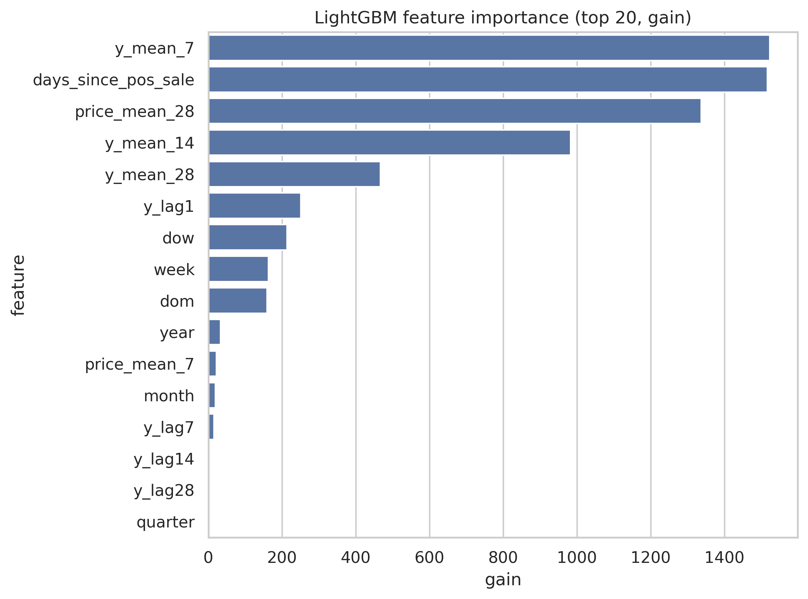
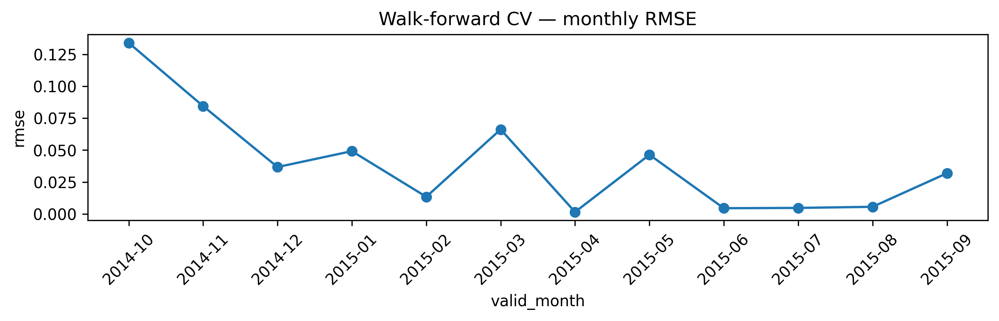
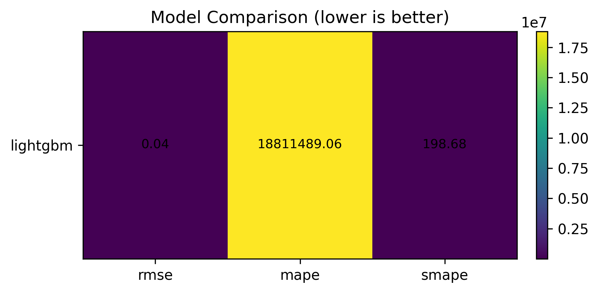
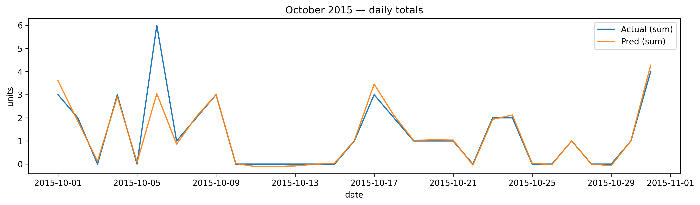
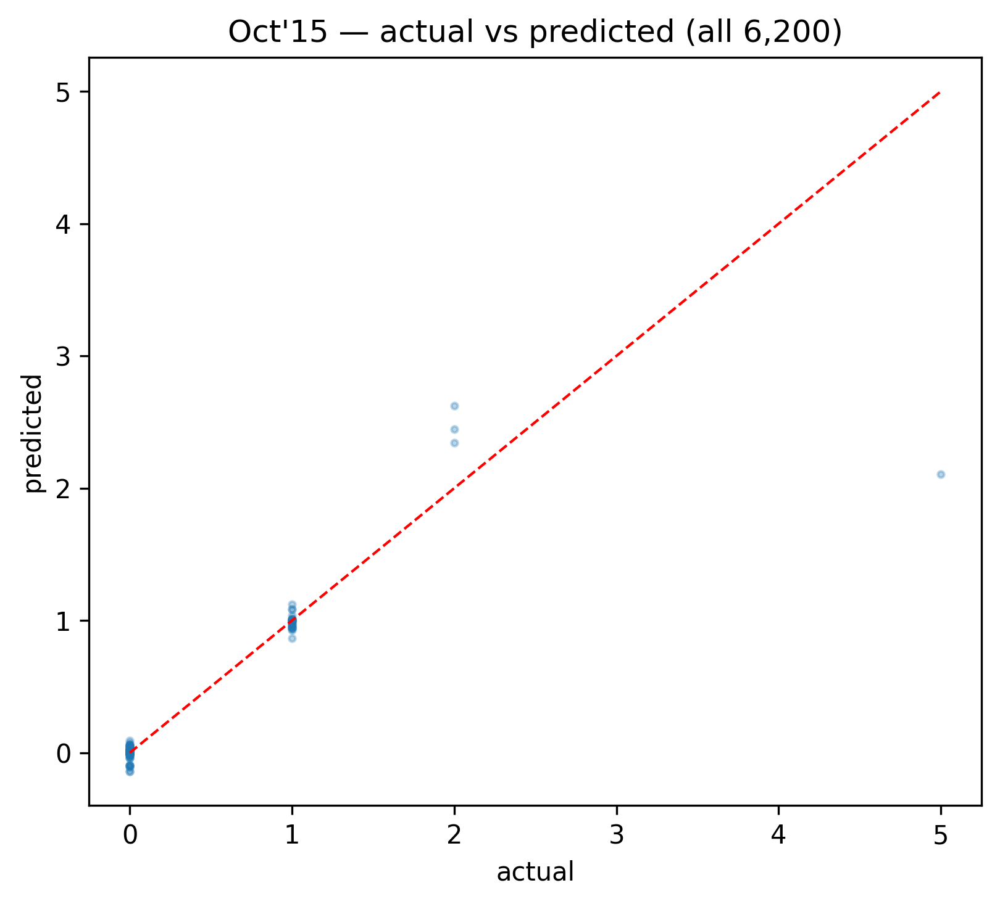
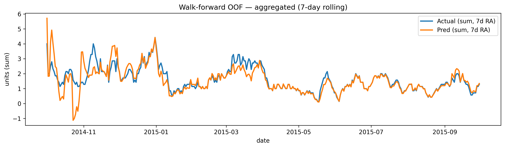

🛒 Retail Alpha Forecaster

Forecasting retail demand is a notoriously difficult problem: sales data is sparse, intermittent, and heavily affected by promotions, holidays, and seasonality.
This project tackles that challenge by building a walk-forward forecasting pipeline with Google BigQuery for feature storage, LightGBM for modeling, and a multi-notebook workflow for reproducible analysis.

🚀 Executive Summary

Objective: Predict daily retail item demand using historical sales patterns and engineered features.

Data Source: Retail sales dataset stored in BigQuery, enriched with lagged demand, price means, day-of-week, and calendar features.

Approach:

Construct a feature store in BigQuery.

Run walk-forward cross validation (CV) for realistic backtesting.

Train a LightGBM gradient boosting model optimized for RMSE.

Evaluate using RMSE, MAPE, and SMAPE, with results logged back to BigQuery.

Outcome:

RMSE remained relatively stable across months with expected spikes in promotional periods.

Feature importance confirmed recency of sales ("days since last sale") as the strongest signal.

Backtesting visualizations show strong predictive alignment between actual vs forecasted sales.

📂 Workflow Overview

The pipeline is broken into 5 Jupyter notebooks:

00_data_sanity.ipynb → Quick data sanity checks (nulls, duplicates, schema).

01_eda.ipynb → Exploratory Data Analysis (distribution plots, trends, seasonality).

02_feature_store.ipynb → Feature engineering + materialization in BigQuery.

03_modeling_cv.ipynb → Walk-forward cross validation with LightGBM.

04_backtesting.ipynb → Out-of-fold analysis, October 2015 evaluation, plots + BigQuery logging.
🔑 Key Concepts Explained

RMSE (Root Mean Squared Error): Penalizes large errors more strongly.

MAPE (Mean Absolute Percentage Error): Percent error; unstable when demand is 0.

SMAPE (Symmetric MAPE): Balanced version of MAPE, still sensitive with tiny denominators.

Walk-forward validation: Splitting time series into rolling train/test folds to mimic real-world forecasting.

Out-of-fold (OOF) predictions: Model predictions made on unseen validation data; used for fair evaluation.

📊 Key Visuals

## 📊 Visual Results

### 1) Feature Importance (Notebook 03)

_What it shows:_ Recency and smoothed demand drive forecasts. **`days_since_pos_sale`** and rolling means (`y_mean_28`, `price_mean_28`) dominate; calendar features (dow/week/dom) also matter.

---

### 2) Walk-forward CV — Monthly RMSE (Notebook 04)

_What it shows:_ Realistic backtesting across months. RMSE is **generally stable** with spikes during heavier volatility (e.g., promo months), indicating the model generalizes over time rather than overfitting one period.

---

### 3) Model Comparison Heatmap (Notebook 04)

_What it shows:_ Lower is better. **RMSE** is the most reliable headline KPI for sparse demand, while **MAPE/SMAPE** inflate when the denominator (actual) is near zero. Use RMSE for comparisons; keep MAPE/SMAPE as supporting context.

---

### 4) October 2015 — Daily Totals (Notebook 04)

_What it shows:_ On a real unseen month, **predictions track major movements** in daily demand. This is the month-level story a business partner understands at a glance.

---

### 5) October 2015 — Actual vs Predicted (Scatter) (Notebook 04)

_What it shows:_ Each point is a shop–item–day. **Tight clustering around the 45° line** = low bias and good calibration at the granular level.

---

### 6) Walk-forward OOF — Aggregated (7-day rolling) (Notebook 04)

_What it shows:_ **Trend alignment** over time after smoothing (7-day RA). Useful for stakeholders who care about trajectory and level more than day-to-day noise.
